# Welcome to QuickBite Takeout!

# 1. Technologies Used

## Backend

### Spring Boot: REST API framework.

### Spring Security: Authentication and authorization.

### MyBatis-Plus: ORM for database operations, integrated with Spring Security for role-based data access.

### Redis: Caching system.

### MySQL: Relational database.

### JavaMailSender: Email service.

## Frontend

### Vue.js: Frontend framework for reactive UI.

### Vuex: State management library for handling application state efficiently.

### Element-UI: UI component library.

### Axios: HTTP client for API requests.

## Others

### Aliyun SMS API: For sending SMS notifications.

# 2. QuickBite Takeout Features 

## (1) User End Features

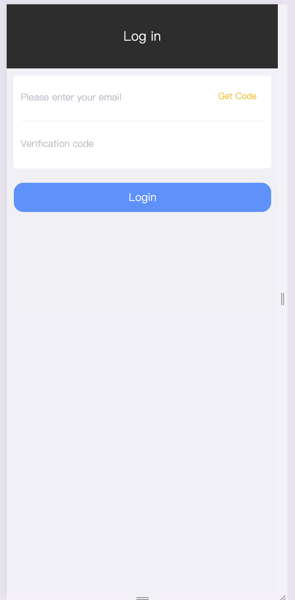
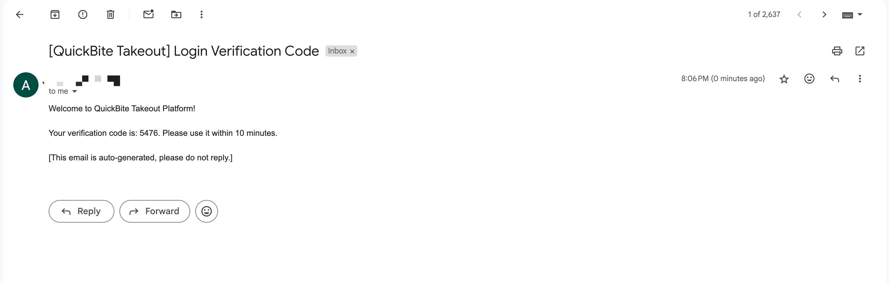
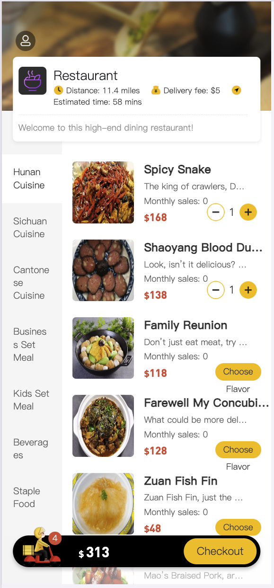
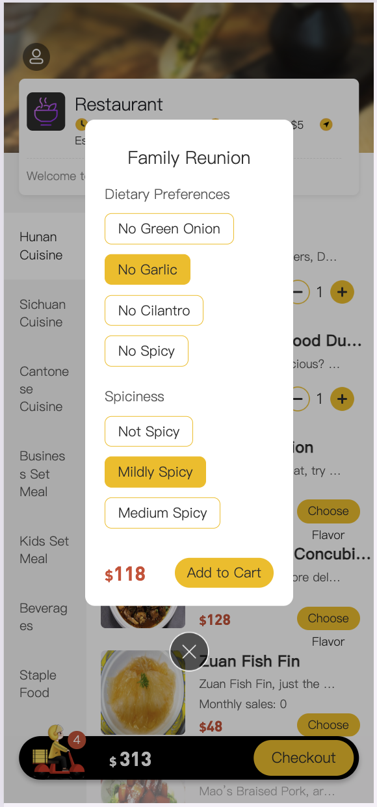
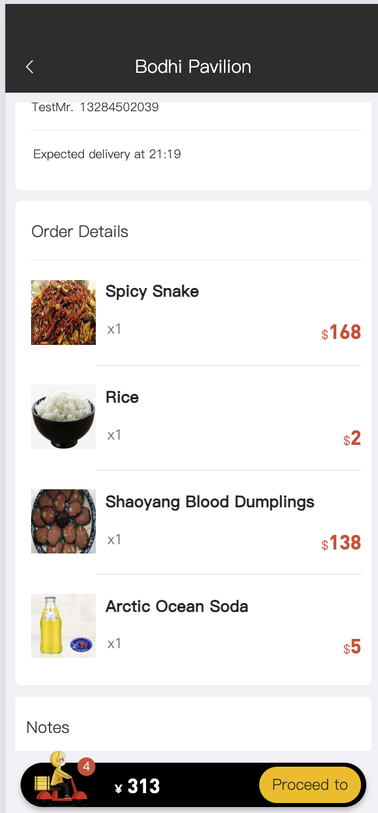
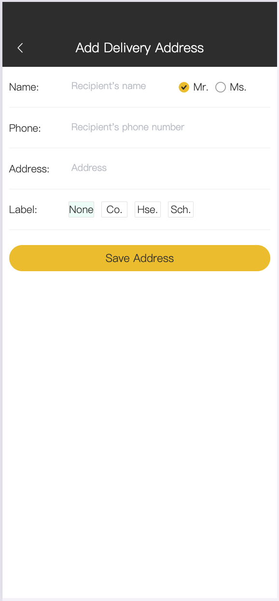

## (2) Admin End Features

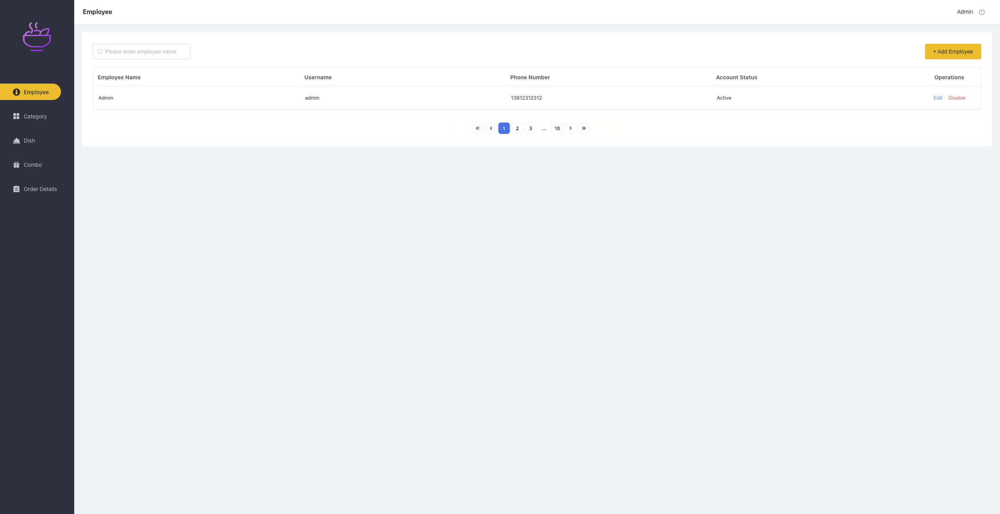
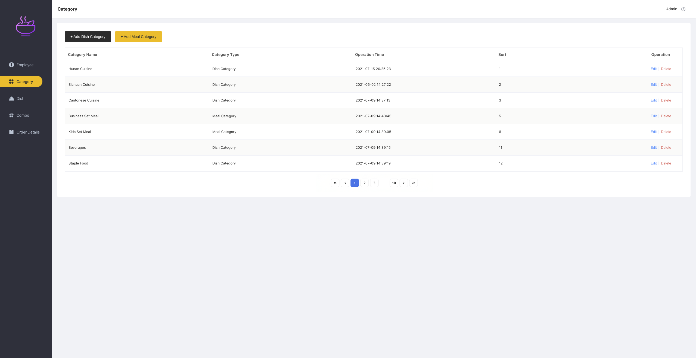
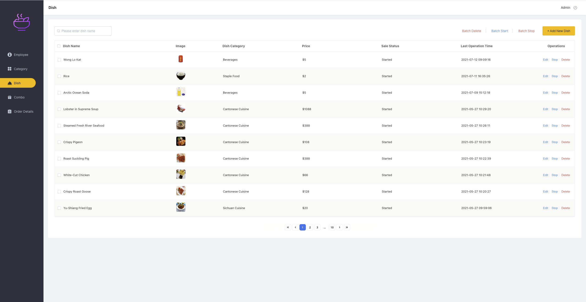
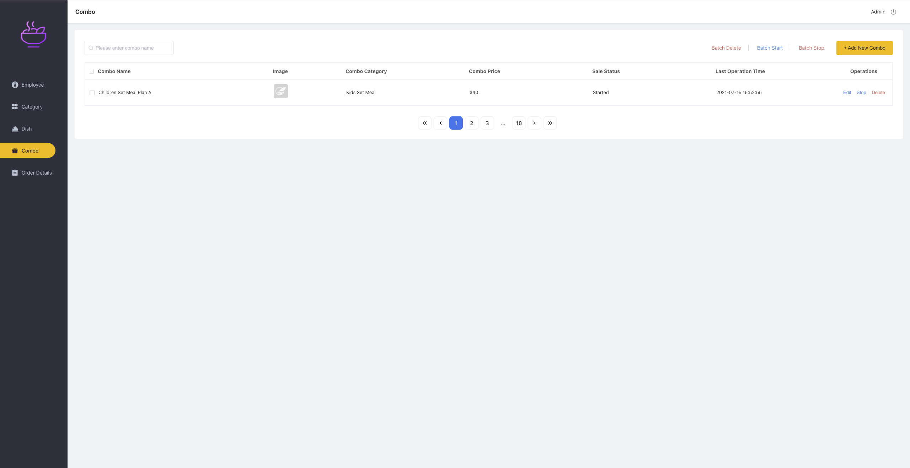
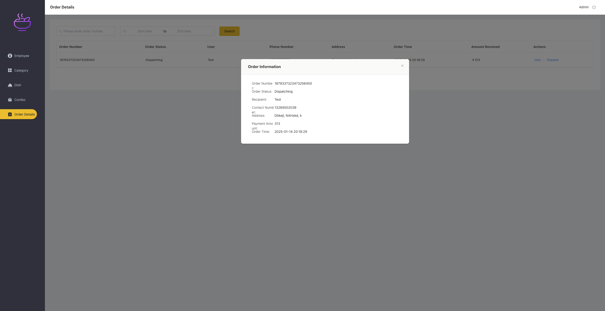

# 3. Project Structure

## (1) Backend

### src/main/java/com/app/quickbite

### controller: RESTful API controllers.

### service: Business logic and service layer.

### mapper: MyBatis mappers for database interaction.

### entity: Java entity classes for database tables.

### config: Configuration files for Redis, MyBatis, etc.

## (2) Frontend

### public/: Static assets.

### src/

### api/: Axios service calls.

### components/: Vue.js components.

### views/: Page components.

### store/: Vuex state management.

# 4. API Endpoints

## (1) Employee Management

### POST /employee/login: Login API.

### POST /employee/logout: Logout API.

### GET /employee/page: List employees with pagination.

### POST /employee: Add employee.

### PUT /employee: Edit or enable/disable employee.

## (2) Category Management

### GET /category/page: List categories with pagination.

### POST /category: Add category.

### PUT /category: Edit category.

### DELETE /category: Delete category.

### Dish Management

### GET /dish/page: List dishes with pagination.

### POST /dish: Add dish.

### PUT /dish: Edit dish.

### DELETE /dish: Delete dish.

## (3) Set Meal Management

### GET /setmeal/page: List set meals with pagination.

### POST /setmeal: Add set meal.

### PUT /setmeal: Edit set meal.

### DELETE /setmeal: Delete set meal.

### POST /setmeal/status: Update set meal availability.

## (4) Order Management

### GET /order/page: List orders with pagination.

### PUT /order: Update order status.

### GET /orderDetail/{id}: Fetch order details.
