# 1. Technologies Used

## Backend

### Spring Boot: REST API framework.

### Spring Security: Authentication and authorization.

### MyBatis-Plus: ORM for database operations, integrated with Spring Security for role-based data access.

### Redis: Caching system.

### MySQL: Relational database.

### JavaMailSender: Email service.

## Frontend

### Vue.js: Frontend framework for reactive UI.

### Vuex: State management library for handling application state efficiently.

### Element-UI: UI component library.

### Axios: HTTP client for API requests.

## Others

### Aliyun SMS API: For sending SMS notifications.

# 2. QuickBite Takeout Features 

## (1) User End Features

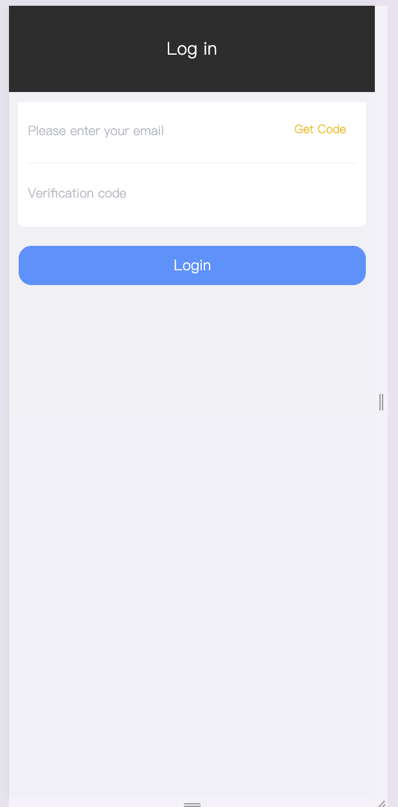

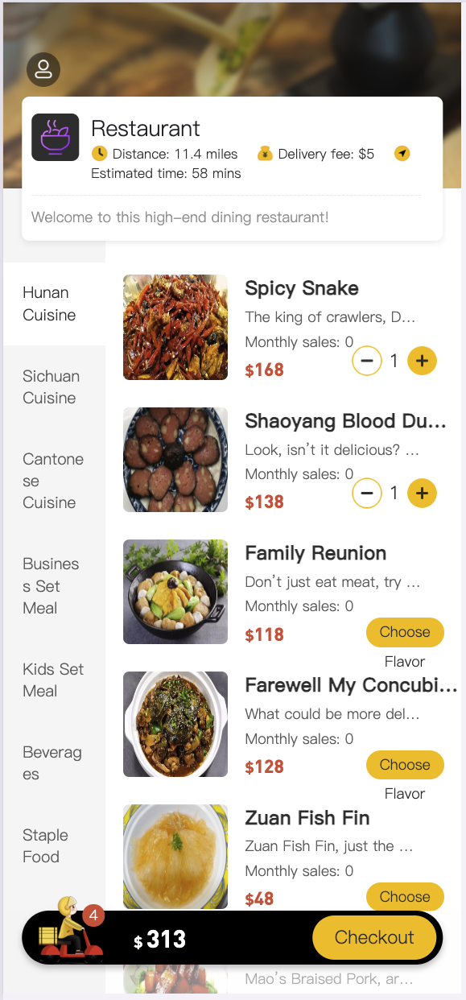
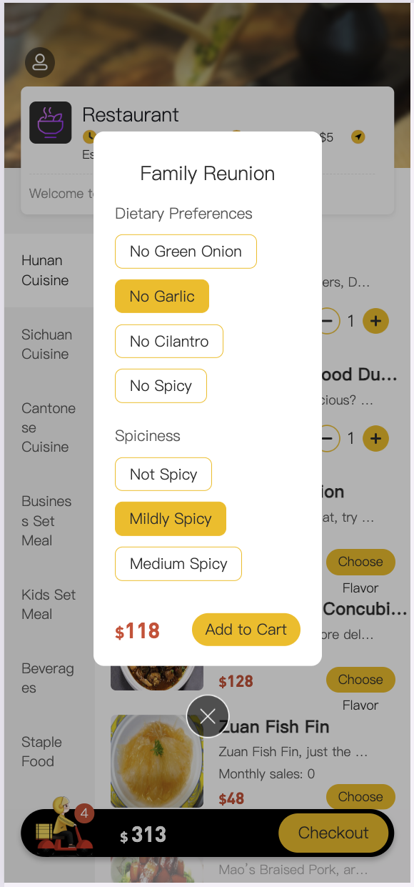
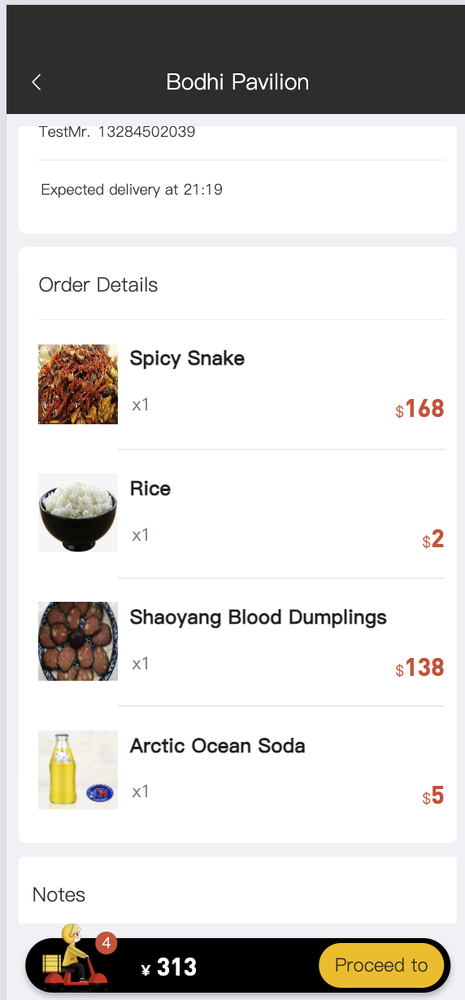
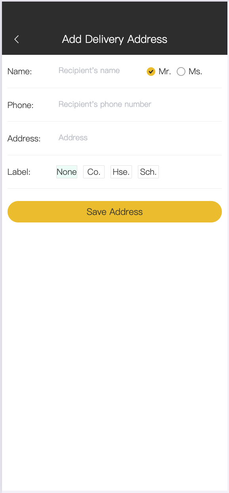
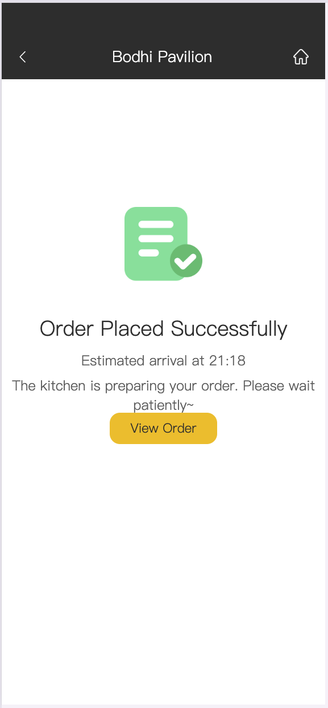

## (2) Admin End Features

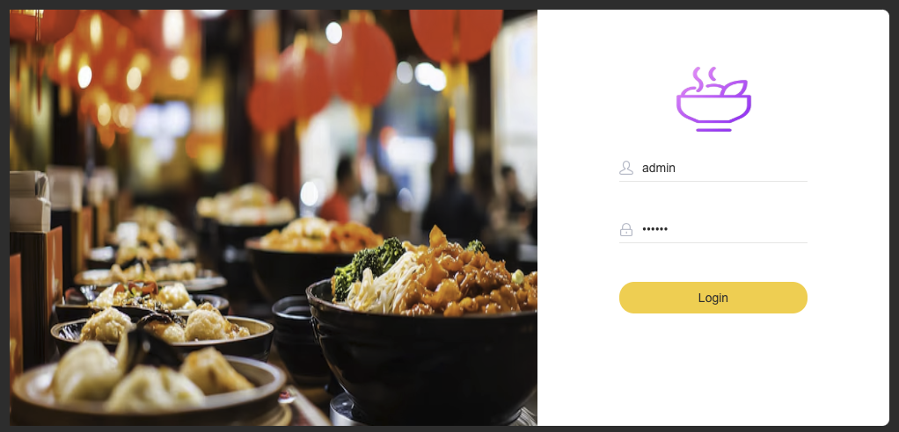
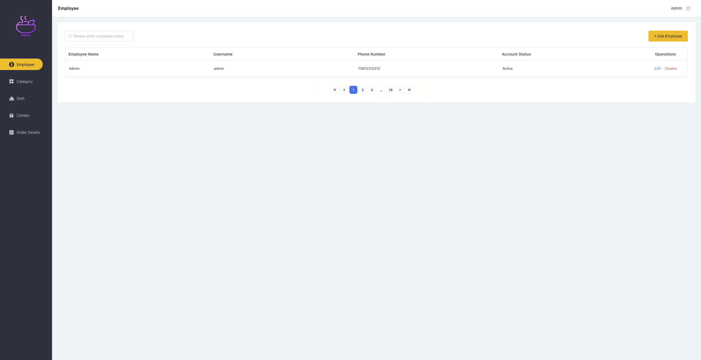

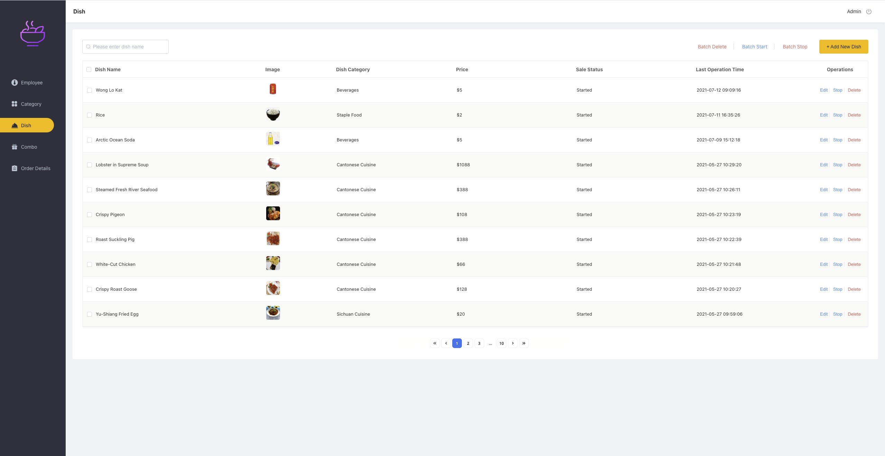
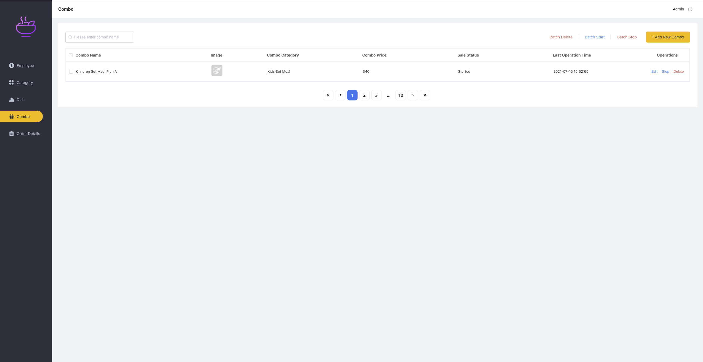
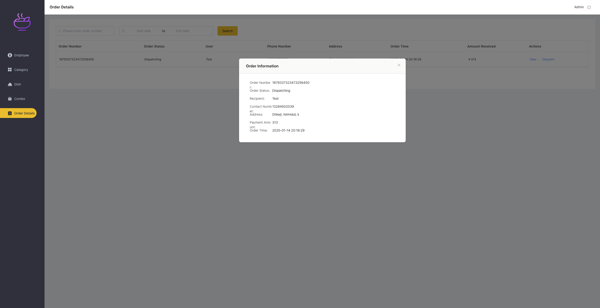
